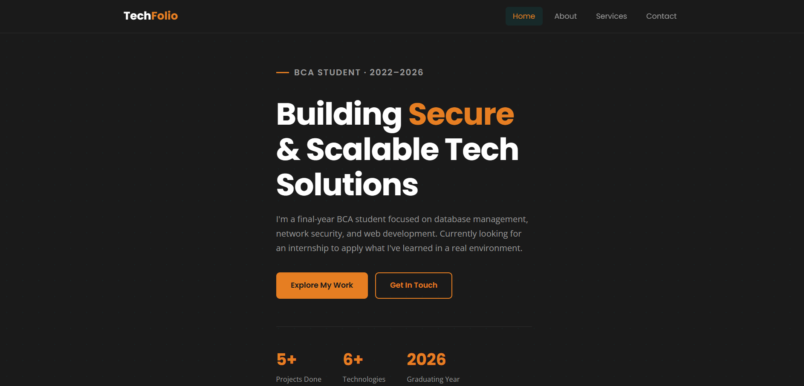
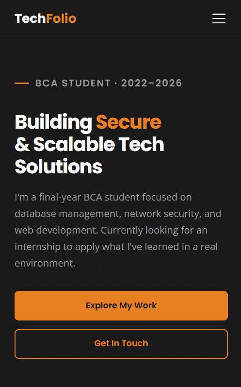
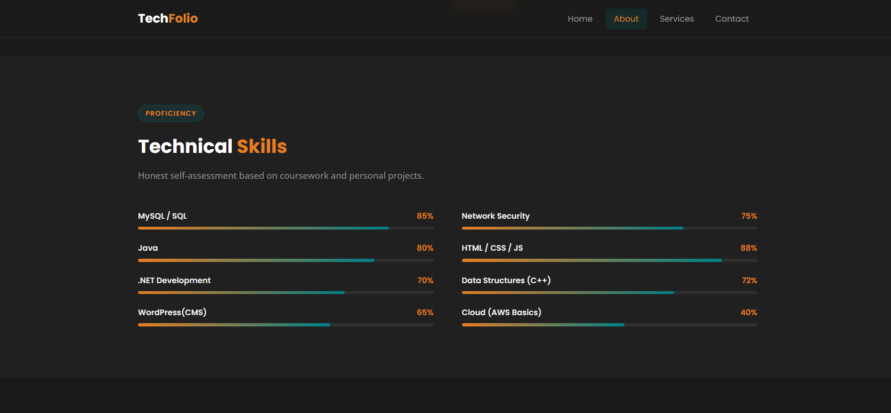
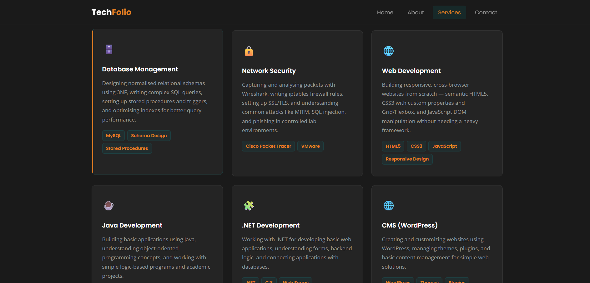
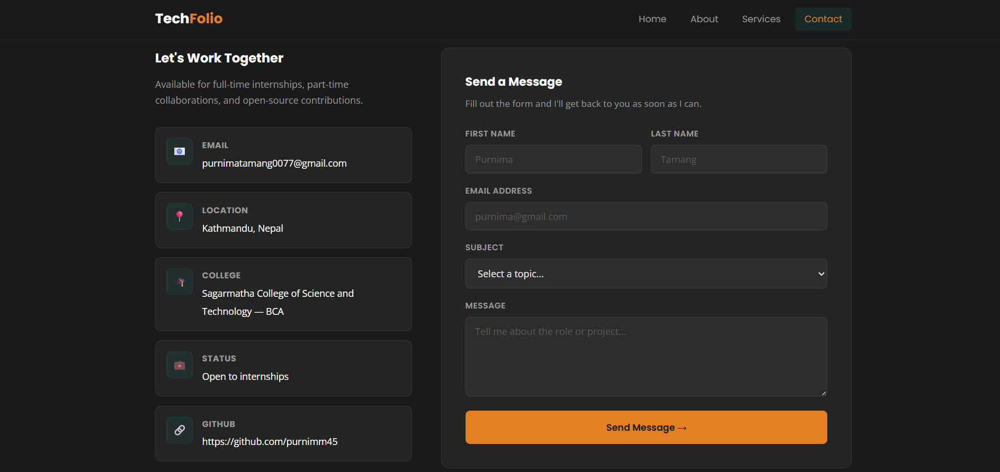
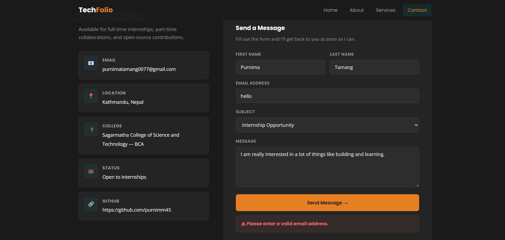

# synent-task7-multipagewebsite-purnima

**Name:** Purnima Tamang
**Email:** purnimatamang0077@gmail.com
**College:** Sagarmatha College of Science and Technology, Lalitpur
**Program:** BCA — 4th Year (2022–2026)
**GitHub:** https://github.com/purnimm45
**LinkedIn:** https://www.linkedin.com/in/purnima-tamang-86b327308/
**Domain:** Web Development
**Task:** Task 7 — Multi-Page Portfolio Website

---

## Objective

Build a fully functional, responsive, multi-page portfolio website with four pages — Home, About, Services, and Contact — sharing a consistent navigation bar and footer. Written in plain HTML, CSS, and JavaScript with no frameworks.

---

## Demo Video

▶️ **https://youtu.be/UZnxUHFitvs**

---

## Screenshots

### Home Page — Desktop


### Home Page — Mobile


### About Page — Skill Bars


### Services Page — Cards


### Contact Page — Form


### Contact Page — Validation


---

## Pages

| File | Page | What it contains |
|------|------|-----------------|
| `index.html` | Home | Hero section, 4 skill cards, CTA banner |
| `about.html` | About | Bio, animated skill bars, education and project timeline |
| `services.html` | Services | 6 service cards, How I Work steps, tech stack pills |
| `contact.html` | Contact | Contact info panel, form with JS validation |
| `style.css` | All pages | Single shared stylesheet for every page |

---

## Tools Used

- **HTML5** — page structure and semantic markup
- **CSS3** — Flexbox, Grid, CSS variables, animations
- **Vanilla JavaScript** — hamburger toggle, scroll-triggered skill bars, form validation
- **Google Fonts** — Poppins (headings), Open Sans (body)
- **Git and GitHub** — version control, 6 commits
- **VS Code** — code editor
- **Chrome DevTools** — responsive testing

No Bootstrap. No Tailwind. No jQuery. Written from scratch.

---

## Steps Performed

1. Planned layout and colour scheme on paper before writing any code
2. Wrote `style.css` first — CSS variables, nav, footer, all shared utilities
3. Built `index.html` — hero, skill cards, CTA banner
4. Built `about.html` — bio, animated skill bars using IntersectionObserver, education and project cards
5. Built `services.html` — 6 service cards, How I Work section, tech stack pills
6. Built `contact.html` — contact info panel, form with JavaScript validation
7. Tested all pages on desktop and mobile in Chrome DevTools
8. Took 6 screenshots, wrote README and report, pushed everything to GitHub

---

## Features

- Sticky navbar with active page highlight
- Hamburger menu for screens below 700px
- Skill bars that animate on scroll using IntersectionObserver API
- Contact form validates empty fields and email format before submitting
- Consistent nav and footer across all 4 pages
- Responsive at 900px, 700px, and 480px breakpoints

---

## Project Structure

```
synent-task7-multipage-website-purnimatamang/
├── index.html
├── about.html
├── services.html
├── contact.html
├── style.css
├── README.md
├── report
└── screenshots/
    ├── 01-home-desktop.png
    ├── 02-home-mobile.png
    ├── 03-about-skills.png
    ├── 04-services-cards.png
    ├── 05-contact-form.png
    └── 06-contact-form-validation.png
```

---

## How to Run

```bash
git clone https://github.com/purnimm45/synent-task7-multipage-website-purnimatamang.git
```

Then open `index.html` in any browser — no server needed.

---

## Git Commit History

| # | Commit Message |
|---|----------------|
| 1 | add global stylesheet with nav, footer and base layout |
| 2 | add home page with hero section and skill preview cards |
| 3 | add about page with bio, skill bars and education timeline |
| 4 | add services page with 6 cards, how I work steps and tech stack |
| 5 | add contact page with info panel and form validation |
| 6 | add README, report and screenshots folder |

These are not only the commits I have. I have multiples of them because I kept reediting them. 
---

## Outcome

Fully working 4-page portfolio site with my real information, real projects (PawBliss and SewaSathi), and skills I genuinely worked on during my BCA. The site is responsive, fast, and the contact form validates properly.

The biggest thing I learned was how much you can do with just HTML, CSS, and a small amount of JavaScript once you understand the fundamentals — no framework needed.

---

*Submitted for Synent Technologies Internship — Task 7*
*Purnima Tamang | purnimatamang0077@gmail.com | 2026*
